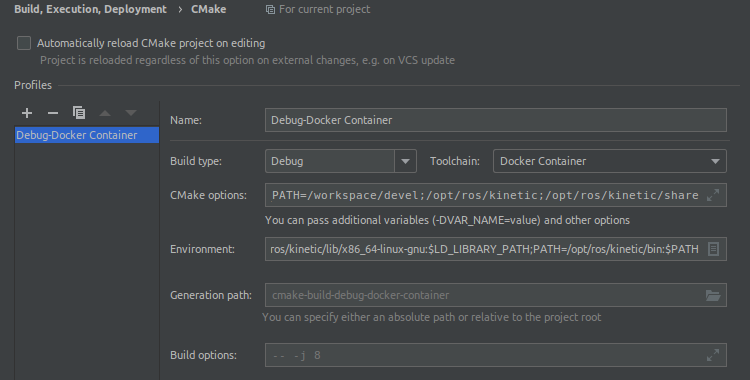

# RoboND Catkin Workspace

Step into the ROS Kinetic Docker container by running

```bash
./run-nvidia.sh
```

This will open a shell as the `ros` user (password `ros`) and place you into the `/workspace`
directory. In the background, an SSH server is started that allows you (or your IDE)
to connect to the Docker container via port `2222`. You can try it out by running

```bash
ssh ros@127.0.0.1 -p2222
```

from a different terminal.

Note that `run-nvidia.sh` makes use of the [`sunside/ros-gazebo-gpu:udacity-robond`](https://hub.docker.com/repository/docker/sunside/ros-gazebo-gpu)
Docker image, because the original `desktop-full` ROS installation (via the [base image](https://github.com/sunsided/ros-gazebo-gpu-docker)) doesn't contain some
required packages, such as

- `ros-kinetic-gazebo-ros-control`,
- `ros-kinetic-effort-controllers`,
- `ros-kinetic-joint-state-controller` etc.

You can either have the required image pulled automatically, or build it yourself from
the provided [Dockerfile](Dockerfile) by running

```bash
docker build --no-cache -t sunside/ros-gazebo-gpu:udacity-robond -f Dockerfile .
```

## Dockerized building in CLion

To get a dockerized build going in CLion we have to apply some rocket science … sauce.

- First, we need to install the `Docker` plugin and configure it to talk to the local Docker daemon; after that, also _connect_ to the Docker daemon in the `Services` toolbar.
- Next, we need to run an SSH server within the Docker container … yes, I know … and expose its port to the host. This is explained in [Docker Plugin Integration](https://www.jetbrains.com/help/clion/docker.html) and [Using Docker with CLion](https://blog.jetbrains.com/clion/2020/01/using-docker-with-clion/); see the provided [Dockerfile](Dockerfile) for how it actually plays out.
- We then create a Remote Host Toolchain that connects to the dockerized SSH server (as described in the above links).
  
- Now, we change the default CMake Configuration to apply some ROS specifics as hinted at in [ROS Setup Tutorial](https://www.jetbrains.com/help/clion/ros-setup-tutorial.html).
  

Since we cannot just start CLion from the Catkin environment as described in the CLion documentation, we have to
configure some CMake and environment variables manually. However, configuring the **Generation path** was not required,
since we cannot point it to Catkins `build` dir without breaking things in various fantastic ways.

Anyway, here's what I added:

- **CMake options:**
  - `-DCATKIN_DEVEL_PREFIX:PATH=/workspace/devel`
  - `-DCMAKE_PREFIX_PATH=/workspace/devel;/opt/ros/kinetic;/opt/ros/kinetic/share`
- **Environment:**
  - `ROS_VERSION=1`
  - `ROS_DISTRO=kinetic`
  - `ROS_MASTER_URI=http://localhost:11311`
  - `ROS_ROOT=/opt/ros/kinetic/share/ros`
  - `ROS_ETC_DIR=/opt/ros/kinetic/etc/ros`
  - `ROS_PACKAGE_PATH=/workspace/src:/opt/ros/kinetic/share`
  - `ROS_PYTHON_VERSION=2`
  - `ROSLISP_PACKAGE_DIRECTORIES=/workspace/devel/share/common-lisp`
  - `PYTHONPATH=/opt/ros/kinetic/lib/python2.7/dist-packages`
  - `LD_LIBRARY_PATH=/workspace/devel/lib:/opt/ros/kinetic/lib:/opt/ros/kinetic/lib/x86_64-linux-gnu:$LD_LIBRARY_PATH`

The above variables were taken from the container by running `env | grep -i ros` and `env | grep -i kinetic`.
When CLion is done trying to understand the environment, we can actually build the project(s) and introspect all referenced headers.

## Setting up a Catkin workspace (once)

Ensure the `src` directory exists, then `cd` into it and call `catkin_init_workspace`
to initiate a new Catkin workspace:

```bash
mkdir -p src && cd src
catkin_init_workspace
```

This should create a result similar to the following:

```
Creating symlink "/workspace/src/CMakeLists.txt" pointing to "/opt/ros/kinetic/share/catkin/cmake/toplevel.cmake"
```

If we run `ls -l`, we find that a symbolic link to Catkin's top-level `CMakeLists.txt` was created:

```
total 0
lrwxrwxrwx 1 ros ros 50 May 21 19:10 CMakeLists.txt -> /opt/ros/kinetic/share/catkin/cmake/toplevel.cmake
```

## Building the workspace

Change back to the root directory of the repository (the one _containing_ `src/`) and call

```bash
catkin_make
```

If we run `ls -l` again we will find, that the following directories exist:

- `build`: The CMake build directory
- `devel`: ROS and Catkin resources, such as `setup.bash`

## Simple Arm


Ensure that all packages are installed as required:

```bash
rosdep install -i simple_arm
```

If a package is missing, this will ask you for permission to
install it. Note that unless you run `sudo apt update` in the
container at least once, these updates will fail. For this project,
the required packages are included in the [`Dockerfile`](Dockerfile)
used to run th environment with.

Build the project via

```bash
catkin_make
```

then run `roslaunch` as described below to run the project:

```
source devel/setup.bash
roslaunch simple_arm robot_spawn.launch
```

If you encounter a warning

```
[WARN] [1590093853.282634, 0.000000]: Controller Spawner couldn't find the expected controller_manager ROS interface.
```

… that probably just means you started Gazebo for the first time in this Container
and it takes a bit too long to do anything.


### Fixing `legacyModeNS` errors for Kinetic

Originally, the code produced the following output:

> ```
> [ERROR] [1590091780.648877316, 261.772000000]: GazeboRosControlPlugin missing <legacyModeNS> while using DefaultRobotHWSim, defaults to true.
> This setting assumes you have an old package with an old implementation of DefaultRobotHWSim, where the robotNamespace is disregarded and absolute paths are used instead.
> If you do not want to fix this issue in an old package just set <legacyModeNS> to true.
> ```

To fix, add the `<legacyModeNS>true</legacyModeNS>` attribute to the appropriate node of the `.gazebo.xacro` file that is affected. You can
use the following command to pinpoint its location:

```bash
./src/simple_arm/urdf/simple_arm.gazebo.xacro
```

See the `src/simple_arm/README.md` for more information.
